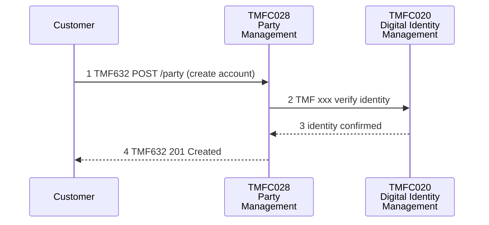

# Draft Architecture Diagram from Use Case — Skill Instructions

## What this skill produces

A set of Mermaid diagrams (`sequenceDiagram` for interaction flow, plus a
`flowchart` component-overview diagram) redrawn from a use case's own
sequence-diagram content and frontmatter links — not a generic diagram
inferred from the use case's name or summary.

## Step 1 — Check maturity first

Run `check-usecase-maturity` against the id and include its verdict in
the output. A diagram drawn from an Alpha/Beta use case should carry that
caveat — the flow it depicts may still change.

## Step 2 — Prefer the PlantUML sources over the images

```
knowledge/use-cases/{ID}/{ID}.md
knowledge/use-cases/{ID}/media/*.puml
```

Find the `# Sequence diagrams` section. Each image reference is usually
followed by a `*([PlantUML source](media/xxx.puml))*` link — **read the
`.puml` file, not the `.png`**. The PlantUML source gives the exact
participants, aliases, step numbers, API names and `box`/`group`/`alt`
structure as text, so the redraw is a faithful transcription rather than
an interpretation of pixels. Fall back to reading the `.png` (the Read
tool handles images directly) only where a diagram has no `.puml`
companion, and to the `*.text-description.md` sidecar files where neither
is usable.

Document shapes vary: some use cases narrate each step with its own
diagram under a `## Step N: ...` subheading, others have one diagram
covering the whole flow with a summary paragraph, and some (like TMFS009)
use a tabular scenario/outcome matrix instead of a diagram at all — if
there's no diagram, redraw from the table's rows or say a diagram isn't
applicable rather than inventing one.

## Step 3 — Resolve every actor/component to a real id

Cross-reference every actor/component the diagram images show against the
use case's own `links.components`/`links.apis` frontmatter. Label diagram
nodes with the real id and name (`TMFC028 Party Management`), not a
paraphrase of what the image's label says. If a diagram box names a
capability with no matching frontmatter entry, label it with the plain
name from the image and note in the diagram's surrounding text that it
isn't backed by a frontmatter id — don't invent one to make the diagram
look complete.

## Step 4 — One diagram per source diagram, never one mega-diagram

Emit a separate Mermaid diagram for each source `.puml`/image, keeping the
use case's own step structure (Step 1, Step 2.1, Step 2.2, Step 3, ...).
A single consolidated diagram with fifteen participants renders so wide
that the text becomes unreadable — the most common complaint about this
skill's output. Each diagram should declare only the participants that
step actually uses.

Open the output with a short index table mapping diagram number → step →
source `.puml` filename, so a reader can trace any diagram back to its
origin.

## Step 5 — Make the diagrams readable: contrast and font size

Mermaid renders against the viewer's canvas, which is **dark** in a dark
VS Code/GitHub theme. Forcing black text without also painting a light
backdrop produces black-on-black. The default theme is little better:
grey-on-white at a small font size.

Put this init directive at the top of every `sequenceDiagram`:

```
%%{init: {'theme':'base','themeVariables':{'fontFamily':'Arial','fontSize':'18px','background':'#ffffff','mainBkg':'#ffffff','textColor':'#000000','primaryColor':'#ffffff','primaryTextColor':'#000000','primaryBorderColor':'#000000','lineColor':'#000000','actorBkg':'#ffffff','actorBorder':'#000000','actorTextColor':'#000000','actorLineColor':'#000000','signalColor':'#000000','signalTextColor':'#000000','labelBoxBkgColor':'#e6e6e6','labelBoxBorderColor':'#000000','labelTextColor':'#000000','loopTextColor':'#000000','noteBkgColor':'#fff2b2','noteBorderColor':'#000000','noteTextColor':'#000000','activationBkgColor':'#e6e6e6','activationBorderColor':'#000000'},'sequence':{'actorFontSize':17,'messageFontSize':16,'noteFontSize':15,'actorFontWeight':'bold','wrap':true,'width':190}}}%%
```

Then wrap **all** messages of the diagram in `rect rgb(255,255,255)` ...
`end`. `themeVariables.background` is only used by Mermaid to compute
contrast — it does not paint anything — so the `rect` is the only way to
guarantee a white surface behind the signal text and arrows.

Other readability rules:

- Break long participant labels with `<br/>`: `TMFC003<br/>Product Order
  Delivery<br/>Orchestration & Mgmt`. Narrow lifelines mean the whole
  diagram fits, so the renderer shows it larger.
- Do **not** use `<br/>` inside `note` text — combined with `wrap:true` it
  makes the text overflow the yellow box. Keep notes to one short line.
- Use `box` groupings only where the source diagram separates domains or
  partners (e.g. Service Provider vs Logistic/Delivery Partner). Don't add
  decorative groups the source doesn't have.
- When a diagram does use `box` groups, invert the fills: light grey
  backdrop `rect rgb(235,235,235)` with `box rgb(255,255,255)` swimlanes,
  so the lanes read as distinct panels. Plain diagrams stay white-on-white.
- Keep the source's `alt`/`loop`/`group` blocks and its step numbers
  verbatim, including any oddities (duplicate numbers across diagrams,
  arrows drawn in a surprising direction) — note the oddity in prose
  rather than silently correcting the diagram.

## Step 6 — Lead with a component overview diagram

Before the sequence diagrams, emit one consolidated component diagram
showing every component and every interaction between them. Place it
**first** — it orients the reader before they descend into step detail.

Draw it as a `flowchart LR`, **not** Mermaid's `classDiagram`: class
diagrams support neither `rect` backdrops nor subgraph fills, so they
cannot be given a guaranteed white background and the relationship arrows
disappear on a dark canvas. A flowchart gives the same class-like content:

- One node per component, labelled `<b>TMFC0xx</b><br/>Name<br/><i>TMF6xx
  /resource</i>` — the italic lines are that component's exposed APIs, the
  flowchart equivalent of class members.
- Wrap everything in an outer `subgraph BG[" "]` styled
  `style BG fill:#ffffff,stroke:#ffffff` — this is the painted white
  backdrop. Group inner subgraphs by ODA functional block (Core Commerce
  Management, Production/domain, Party & Communications, Supply Chain &
  Partners).
- Solid `-->` for direct API calls, dashed `-.->` for event/notification
  flows, each labelled with the API and operation
  (`TMF641 POST serviceOrder`). Set `'edgeLabelBackground':'#ffffff'` so
  edge labels keep their own white pill.
- Give unbacked actors (no TMFC id) and any frontmatter-linked component
  that no diagram exercises a dashed outline via `classDef`, and say so in
  the prose beneath.

This diagram must add nothing: every arrow in it has to correspond to an
interaction already drawn in one of the sequence diagrams.

## Output format

Order the artifact as: maturity caveat → index table → component overview
diagram → one sequence diagram per step → "Sources and caveats".

Keep participant names exactly matching the real ids from Step 3 — a
reader should be able to cross-reference every box in every diagram back
to `knowledge/index/components.json` or `apis.json` directly.

The "Sources and caveats" section lists which `.puml` files and
frontmatter fields each diagram came from, which actors are not backed by
a frontmatter id, which linked components/APIs the flows never exercise,
and any quirks preserved verbatim from the source.

When asked to save the artifact, write it to
`output/{ID}-architecture-diagrams.md`.

Example shape of a single sequence diagram (init directive elided):



## What this skill does NOT do

- Does not invent steps or actors not shown in the source diagram images or described in the Sequence Diagrams section — this is a redraw, not a fresh design.
- Does not draft Gherkin test scenarios — that's `generate-test-cases-from-usecase`'s job; this skill's output is a visual artifact, not test cases.
- Does not skip the maturity check — every diagram carries its source use case's maturity caveat.
- Does not "tidy up" the source: surprising arrow directions, duplicate step numbers and open issues flagged in the document stay in the redraw, called out in prose.
